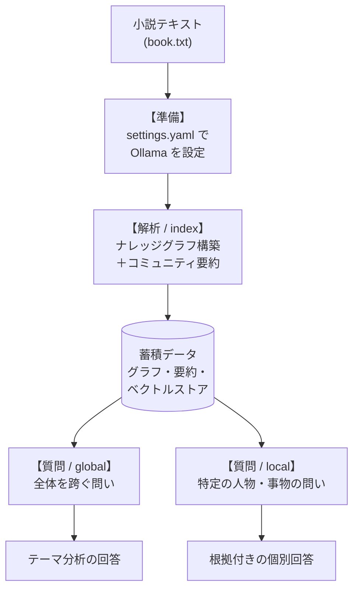

# GraphRAG ではじめる物語の読み解き（ローカル Ollama 実践記）

長い小説を読み終えたあと、「結局この物語のテーマは何だったのか」「登場人物どうしの関係はどう変わっていったのか」を一気に振り返りたくなることがあります。[GraphRAG](https://github.com/microsoft/graphrag) は、こうした「文章全体を俯瞰する問い」に答えてくれるツールです。

このドキュメントは、GraphRAG を実際に**使う人の視点**から、セットアップ → 解析 → 質問という流れに沿って手順を追っていく記事です。あわせて、各ステップで**裏側ではどんなことが起きているのか**を、イメージしやすい形で補足していきます。

題材には公式の [Get Started](https://github.com/microsoft/graphrag/blob/main/docs/get_started.md) と同じく、チャールズ・ディケンズの小説『クリスマス・キャロル』を使います。LLM はクラウドの API ではなく、手元（あるいは社内ネットワーク）の **Ollama** で動かすローカルモデルを利用します。

> [!NOTE]
> GraphRAG の内部構造やソースコードレベルの動作（LLM ログの記録・解析など）に踏み込みたい場合は、技術ドキュメント [GraphRAG-B.md](GraphRAG-B.md) を参照してください。本記事は「使いながら背景の動きをイメージできる」ことを目標にしています。

---

## GraphRAG とは何か

GraphRAG (Graph Retrieval-Augmented Generation) は、LLM の力で非構造化テキストから**意味のある構造（ナレッジグラフ）**を抽出し、それをもとに質問応答を行う仕組みです。

従来のキーワード検索や、文章を断片的に拾ってくるベクトル検索ベースの RAG では、次のような問いに答えるのが苦手でした。GraphRAG はまさにこの領域を得意とします。

* **文書全体を跨ぐ問い**（例：「この物語の主要なテーマは何ですか？」）
* **情報のつながりの追跡・要約**（例：「登場人物 A と B の関係はどう変化しましたか？」）

ポイントは、GraphRAG が事前に小説全体を読み込み、登場人物・場所・出来事を「ノード」、それらの関係を「エッジ」とする**地図（グラフ）**を作っておくことです。質問が来たときは、この地図を辿って答えを組み立てます。

> [!NOTE]
> **得意・不得意があります。** GraphRAG は上記のような「全体像」「つながり」を問う質問に強い一方で、「ある場面で誰が何回〜したか」「そのとき何という名前だったか」のような**ピンポイントな事実の検索は得意ではありません**。グラフやコミュニティ要約は文章を要約・抽象化して作られるため、細部はそぎ落とされやすく、そうした事実は元の文章（チャンク）そのものへの検索に頼ることになるからです。この向き・不向きが生まれる仕組み上の背景は、[GraphRAG-B.md](GraphRAG-B.md) の「3. 考察：GraphRAG は文章を完全にはグラフ化しない」で説明しています。

---

## 1. まず全体像をつかむ

細かい手順に入る前に、GraphRAG を使う流れと、そのとき裏側で何が起きるのかを俯瞰しておきましょう。大きく **「準備 → 解析（インデックス作成）→ 質問」** の3段階です。



* **準備**: どの LLM を使うかなどを設定ファイルに書きます。今回は Ollama 上のローカルモデルを指定します。
* **解析（インデックス作成）**: 小説を読み込んで、登場人物・関係性のグラフと、その要約を作り上げます。**ここが最も時間のかかる工程**で、裏では LLM を何百回も呼び出しています。
* **質問**: 出来上がったデータに対して問いを投げます。物語全体を見渡す **Global Search** と、特定の人物などに絞り込む **Local Search** の2種類があります。

一度「解析」を済ませてしまえば、あとは何度でも質問できる、というのが基本的な使い方です。

---

## 2. 準備する（セットアップ）

### 2.1 使える LLM について

GraphRAG は内部で [LiteLLM](https://docs.litellm.ai/) を介してモデルを呼び出すため、OpenAI の GPT-4 系をはじめ、Gemini・Anthropic Claude・ローカルの Ollama など 100 種類以上のモデルに対応しています。`settings.yaml` で `model_provider` と `model` を指定するだけで切り替えられます。

> [!IMPORTANT]
> **構造化出力 (JSON) への対応が必須です。**
> GraphRAG は解析の途中で、**エンティティ・関係性の抽出**やエンティティ種別・コミュニティ要約を「決まった形の JSON」で受け取ります。選ぶモデルは **JSON スキーマに準拠した構造化出力（Structured Outputs / JSON Mode）** をサポートしている必要があります。

### 2.2 プロジェクトを作る

独立した検証用スペースを作り、パッケージを入れて初期化します。

```bash
# 1. ワークスペースを作成し、依存パッケージを仮想環境へ同期
uv init graphrag-test
cd graphrag-test
uv add graphrag

# 2. 作業用ディレクトリを作って移動
mkdir quickstart
cd quickstart

# 3. 初期化
uv run graphrag init
```

対話プロンプトはデフォルトのまま Enter で進め、設定は後からファイルで編集します。`graphrag init` を実行すると、設定ファイル `settings.yaml` と環境変数ファイル `.env` が生成されます。

### 2.3 Ollama を指定する（と、ローカルモデル特有の落とし穴）

生成された `quickstart/settings.yaml` を編集し、LLM と埋め込みモデルに Ollama を指定します。

ここでローカルの推論モデル（例：31B/26B クラス）を使う場合、クラウド API では起きにくい**2つの落とし穴**に対処しておくと安心です。

1. **タイムアウトエラー**: GraphRAG は既定で最大 25 並列でリクエストを飛ばします。手元の 1 台で動く Ollama サーバーには過負荷で、コネクションが切れてしまうことがあります。→ **同時リクエスト数を `1` に制限**します。
2. **推論の遅延**: 推論（reasoning）モデルは長い「思考プロセス」を挟むため、大量のチャンクを処理する解析フェーズで膨大な時間がかかります。→ **`reasoning_effort: "none"`** で思考プロセスを無効化します（Ollama の `think: false` に対応）。

また、環境変数 `OLLAMA_HOST` に IP アドレスだけ（例: `192.168.0.8`）が設定されている場合は、ポート `11434` と `http://` を補った URL 形式で接続先を指定します。同じマシンで Ollama を動かしている場合は `localhost` を指定します。

**設定例 (`settings.yaml`)**:

```yaml
# 落とし穴1への対策：同時リクエスト数を1に制限（トップレベルに追記）
concurrent_requests: 1

completion_models:
  default_completion_model:
    model_provider: ollama
    model: gemma4:26b-a4b-it-qat       # 使用する LLM のモデル名
    auth_method: api_key
    api_key: ${GRAPHRAG_API_KEY}       # .env に設定。不要ならダミー文字でも可
    api_base: http://${OLLAMA_HOST}:11434  # 環境変数を URL 形式に補正
    retry:
      type: exponential_backoff
    # 落とし穴2への対策：思考プロセスを無効化して時間を短縮
    call_args:
      reasoning_effort: "none"

embedding_models:
  default_embedding_model:
    model_provider: ollama
    model: embeddinggemma              # 使用する埋め込みモデル名
    auth_method: api_key
    api_key: ${GRAPHRAG_API_KEY}
    api_base: http://${OLLAMA_HOST}:11434
    retry:
      type: exponential_backoff
```

> [!NOTE]
> 埋め込み（embedding）モデルは、解析の最終盤や質問時に「文章をベクトル（数値の並び）に変換して似たものを探す」ために使われます。文章を生成する LLM とは別の役割なので、両方を指定しておきます。

### 2.4 題材テキストを置く

公式クイックスタート [get_started.md](https://github.com/microsoft/graphrag/blob/main/docs/get_started.md) に倣い、『クリスマス・キャロル』のテキストを `input/` ディレクトリに配置します。

```bash
curl https://www.gutenberg.org/cache/epub/24022/pg24022.txt -o input/book.txt
```

> [!NOTE]
> input/ ディレクトリは `graphrag init` 実行時に作成されます。

---

## 3. （任意）日本語に最適化する

日本語のテキストを扱う場合、デフォルトのプロンプトは英語で書かれているため、使うモデルによっては出力される説明文やレポートが英語になってしまうことがあります。

> [!NOTE]
> 今回使用している **Gemma 4 では、このステップを行わなくても日本語で出力されます。** ここで紹介するのは、モデルが英語で出力してしまう場合や、より日本語の題材に最適化したい場合に**こういう方法もある**、という選択肢の一つです。必須ではないので、まずは飛ばして次の解析に進んでも構いません。

最初から確実に日本語で処理・出力させたいときは、**解析の前に**自動プロンプトチューニングを実行しておく方法があります。

```bash
uv run graphrag prompt-tune --language Japanese
```

> [!NOTE]
> **実行のタイミング**
> プロンプトチューニングは、前のステップで**入力テキスト（`input/book.txt`）を配置した状態**で実行します。GraphRAG が実際の文章を読んで最適化するためです。

**このとき裏側では:** GraphRAG は小説の抜粋を LLM に読ませ、テキストの性質に合わせて後続フェーズ用のプロンプトを段階的に組み立てています。おおむね「**ドメイン特定**（＝これは文学作品だ、という判断）→ **専門家ペルソナの定義** → **評価基準の作成** → **エンティティ種別の決定**（person / location / spirit など）→ **抽出のお手本（Few-Shot 例）の生成** → **要約レポーター役割の定義**」という順序です。こうして「この題材を読むのに向いたプロンプト一式」が `prompts/` ディレクトリに生成されます。

> [!TIP]
> **プロンプトチューニングは「出力言語」だけの話ではありません。**
> 上の「裏側」を見ると分かるとおり、このステップでは**エンティティ種別（`entity_types`）・抽出の Few-Shot 例・ペルソナ**などが、題材テキストに合わせて作り直されます。既定のプロンプトは汎用的な `entity_types`（`organization` / `person` / `geo` / `event` など）で抽出するため、題材によっては重要な細部（たとえば「物」「食べ物」「心情」「時間」といった種別の事物）が**ノード化されず取りこぼされがち**です。prompt-tune を実行すると、題材に即した `entity_types` や抽出例が用意され、グラフに取り込まれる情報の網羅性が上がります。
>
> つまり**出力がすでに日本語であっても、解析の質を上げる目的で実行する価値があります**。GraphRAG のグラフは「文章を残らず形式化したもの」ではなく、抽出された種別に沿った情報だけを取り込む索引なので、最初の `entity_types` を題材に合わせておくことが、後段の Local / Global の回答品質に効いてきます（この性質の詳細は [GraphRAG-B.md](GraphRAG-B.md) の「3. 考察：GraphRAG は文章を完全にはグラフ化しない」を参照）。

---

## 4. 解析する（インデックス作成）

設定とデータが整ったら、いよいよ解析の実行です。

```bash
uv run graphrag index
```

結果は `output/` ディレクトリに、各種 Parquet ファイルとベクトルデータベース（LanceDB）として保存されます。

> [!NOTE]
> **Parquet（パーケイ）ファイルとは**、表形式のデータを効率よく保存するためのファイル形式です。CSV のように行と列からなる「表」を保存しますが、列ごとにまとめて圧縮して格納するため、ファイルサイズが小さく、大量データの読み込みも高速という特徴があります（データ分析の分野で広く使われています）。GraphRAG はエンティティや関係性などの表を、この形式（`entities.parquet`、`relationships.parquet` など）で出力します。中身を確認したいときは、Python の [pandas](https://pandas.pydata.org/)（`pd.read_parquet()`）などで読み込めます。

**所要時間の目安**: 約 20 分 30 秒（EVO-X2 / Ryzen AI MAX+ 395）。プロンプトチューニングで日本語化した場合は約 37 分。

### このとき裏側では何が起きているか

`index` コマンドの裏では、小説が次のような流れで「読まれて」グラフに変換されていきます。LLM が活躍する工程と、プログラムが機械的に処理する工程が交互に挟まります。

1. **チャンク分割**: 小説を一定トークン（例: 1200 トークン）ごとの小さな塊（テキストユニット）に分割します。LLM が一度に読める量に合わせるためです。*（機械的処理）*
2. **エンティティ・関係性の抽出**: 各チャンクを LLM に読ませ、「登場する人物・場所・物（ノード）」と「それらの関係（エッジ）」を取り出します。取りこぼしを減らすため「まだ他にある？」と問い直す** glean ループ**も回します。*（LLM）*
3. **名寄せ・説明の統合**: 別々のチャンクに登場した同じ人物（例: 異なる章の Bob Cratchit）を 1 つにまとめ、断片的な記述を**物語全体を通した一貫した説明文**へと統合します。*（LLM）*
4. **コミュニティ検出**: 出来上がったグラフを、関係の近いものどうしのグループ（コミュニティ）に分けます。*（機械的処理 / Leiden アルゴリズム）*
5. **コミュニティ要約レポートの生成**: 各コミュニティについて、何が起きているグループなのかを LLM が要約レポート（タイトル・要約・主要な発見・重要度スコア）にまとめます。*（LLM）*
6. **ベクトル化**: テキストユニット・エンティティ・レポートを埋め込みモデルでベクトル化し、ベクトルストア（LanceDB）に格納します。これが質問時の「似たもの探し」の土台になります。*（機械的処理）*

20 分超という時間の大半は、ステップ 2・3・5 で **LLM を何百回も呼び出している**ことによるものです。ローカルモデルで動かしていると、ここで先ほどの「並列数を 1 に」「思考プロセス無効化」という対策が効いてきます。

### どんなデータが作られるのか（軽量な見本）

解析が終わると、`output/` には主に次のようなテーブルができます。中身のイメージだけ掴んでおきましょう。

**entities（エンティティ＝ノード）** — 抽出された登場人物・場所・物の一覧。

| title（名前） | type（分類） | description（全体を通した説明） | frequency（出現回数） |
| :--- | :--- | :--- | :--- |
| Ebenezer Scrooge | `person` | 物語の主人公。強欲な老人。3 人の精霊との出会いを経て改心する。 | 42 |

**relationships（関係性＝エッジ）** — ノードどうしのつながり。同じ場面で何度も関わるほど `weight`（関係の強さ）が大きくなります。

| source | target | description | weight |
| :--- | :--- | :--- | :--- |
| Ebenezer Scrooge | Bob Cratchit | ボブはスクルージの事務所の事務員。冷遇されている。 | 5.0 |

**community_reports（コミュニティ要約）** — 関係の近いグループごとに、LLM が作った要約レポート。タイトル・要約・主要な発見・重要度スコアを持ちます。Global Search はこのレポート群を読んで全体像を答えます。

> [!NOTE]
> エンティティの `description` は、その人物に言及している箇所をすべて統合して LLM が書き起こしたプロフィールです。たとえば Bob Cratchit なら「週給 15 シリングの薄給の事務員で、カムデン・タウンの質素な家に家族と住み…」といった、原文の複数箇所にまたがる情報が 1 つの紹介文にまとまります。

---

## 5. 質問する（クエリ）

解析が終われば、構築したデータに対して何度でも質問できます。問いの性質に合わせて 2 つの方法を使い分けます。

### A. Global Search（全体を跨ぐ問い）

物語全体のテーマ、共通する葛藤、要約など、**マクロな問い**に向いています。

```bash
uv run graphrag query --method global "この物語の主要なテーマは何ですか？"
```

**このとき裏側では:** GraphRAG は先ほど作った**コミュニティ要約レポート群**を Map-Reduce で集約します。まず各レポートから要点と重要度スコアを抽出し（Map）、続いてそれらを束ねて 1 つの回答にまとめます（Reduce）。個々の文章を逐一読むのではなく、要約の要約を作るイメージです。

実際の出力は、根拠となるレポート番号（`[Data: Reports (...)]`）付きの Markdown レポートとして返ってきます。

> # 物語の主要なテーマに関する分析
> 
> この物語は、個人の精神的な変容、社会的な責任、そして時間と因果関係が織り成す多層的な構造を持っています。以下にその主要なテーマを詳述します。
> 
> ### 精神的・道徳的な変容と社会的責任
> 物語の核心は、主人公エベネザー・スクルージの精神的および道徳的な変容にあります [Data: Reports (1, 3, 7, 11)]。当初、彼は孤独で強欲な個人として描かれていますが、超自然的な介入を通じて、他者への慈悲や社会的義務（慈善活動や家族への支援）へと向かう動的なプロセスを辿ります [Data: Reports (10)]。
> 
> この変容は、単なる個人の心境の変化に留まらず、「経済的孤立から社会的統合へ」という側面を持っています。かつてスクルージは銀行の帳簿に執着し、貧困層を拒絶する限定的な関係しか持っていませんでしたが、物語終盤では労働者階級との間に新たな互助的な絆を形成することになります [Data: Reports (10)]。
> 
> ### 社会経済的な対比と家族の絆
> 物語には、鮮明な社会経済的な対比構造が存在します。スクルージの閉鎖的なビジネスの世界と、「貧困層（THE POOR AND DESTITUTE）」や「クラチット家」に代表される困窮した労働者階級の生活との間には、明確な断絶が描かれています [Data: Reports (1, 2, 4)]。
> 
> しかし、こうした経済的な欠乏とは対照的に、精神的な豊かさが示唆される場面もあります。例えば、クラチット家における「プディング」を囲む食卓の儀式は、家族の結束を象徴しています [Data: Reports (2, 16)]。このように、経済的に厳しい状況下においても、家族の絆や情緒的なつながりは、精神的な支柱や救済の象徴として描かれています [Data: Reports (2, 15, 18)]。
> 
> ### 時間の構造と因果応報
> 物語は、非線形的な時間の構造を通じて、個人の行動が運命に与える影響を示唆しています。三つの精霊（過去・現在・未来）による訪問は、スクルージの記憶、現在の社会状況、そして死や孤独といった実存的な帰結を象徴しており、時間軸の再構成が行われています [Data: Reports (10)]。
> 
> この時間の流れの中で、因果応報の概念が重要な役割を果たします。ジェイコブ・マーレイの亡霊や精霊たちの訪問を通じて、過去・現在・未来という時間の流れが表現されています [Data: Reports (1, 3, 8, 17)]。また、ジェイコブ・マーレイ自身が、生前のビジネスへの執着や犯した罪の象徴として、自らの意志で鍛造した「鎖」を纏っていることは、罪と悔恨を視覚化しており、物語に構造的な重層性と精神的葛藤をもたらしています [Data: Reports (12)]。
> 
> ### 祝祭の精神性
> クリスマスという祝祭の精神性は重要なテーマであり、それは慈善的で喜ばしいものとして肯定的に捉えられる一方で、社会的なつながりや家族の絆を象徴する要素でもあります [Data: Reports (1, 3, 13)]。

回答末尾の `[Data: Reports (...)]` は、その記述がどのコミュニティ要約レポートに基づいているかを示す根拠です。これを辿ることで、回答の出どころを確認できます。

**所要時間の目安**: 約 1 分

### B. Local Search（特定の人物・事物の問い）

特定の登場人物や出来事など、**固有名詞に焦点を当てた問い**に向いています。

```bash
uv run graphrag query --method local "スクルージはどのような人物で、誰とどのような関係がありますか？"
```

**このとき裏側では:** GraphRAG はまず質問文をベクトル化し、エンティティ説明のベクトルに対して**類似検索**を行って関連の深いノードを選び出します。続いてその周辺の関係性や元の原文を、LLM のコンテキストに収まる範囲で集めてきて、一発で回答を組み立てます。

実際の出力では、人物像が整理され、周辺人物との関係が根拠 ID 付きで丁寧に解説されます。

> エベネザー・スクルージ（Ebenezer Scrooge）の人物像とその人間関係について、提供されたデータに基づき解説します。
> 
> ### スクルージの人物像：変容する魂
> 物語の序盤におけるスクルージは、非常に強欲で冷酷、かつ極めて吝嗇な性格を持つ老人として描かれています [Data: Entities (25); Reports (1)]。彼は孤独を好み、社交的な場を嫌い、クリスマスを「インチキ（humbug）」と切り捨てるなど、周囲に対して非情で否定的な態度をとる人物でした [Data: Entities (25)]。また、自身の生活やビジネスの利益のみに執着し、貧困層への慈善活動も拒絶していました [Data: Entities (25); Reports (1)]。
> 
> しかし、亡きパートナーであるジェイコブ・マーレイの幽霊からの警告と、過去・現在・未来を司る三つの精霊たちの導きにより、彼の運命は劇的な変化を遂げます [Data: Entities (25); Reports (1)]。自身の過ちや孤独な過去、そして他者への無関心が招く凄惨な結末に直面したことで改心を誓い、最終的には寛大で慈悲深い人物へと変貌を遂げました [Data: Entities (25); Sources (37)]。
> 
> ### 主要な人間関係
> スクルージの周囲には、物語の展開において重要な役割を果たす複数の人物が存在します。
> 
> *   **ビジネス・過去の関係者:**
>     かつてのパートナーであり、現在は亡人であるジェイコブ・マーレイ（Jacob Marley）は、スクルージに対して警告を与える重要な存在です [Data: Entities (26, 84); Relationships (37, 49)]。また、かつてフェジウィッグ（Fezziwig）のもとで徒弟修行をしていた時期もありました [Data: Entities (25); Relationships (68, 65)]。
> 
> *   **家族・親族:**
>     スクルージには愛すべき家族とのつながりがあります。彼の甥であるフレッド（Fred/Scrooge's Nephew）は、明るく快活な性格で、叔父の改心を望み、食事に招待するなど、関係改善を試みています [Data: Entities (15, 43); Relationships (17, 117)]。また、スクルージにはファン（Fan）という妹がおり、彼女は非常に愛情深い性格でした [Data: Entities (16); Sources (13)]。
> 
> *   **従業員・社会的なつながり:**
>     事務員のボブ・クラチット（Bob Cratchit）とは、以前は厳格な雇用主と従業員という関係でしたが、改心後のスクルージは彼の給料を上げ、家族を支援する「第二の父親」のような存在となりました [Data: Entities (3); Relationships (157, 162, 165)]。
> 
> ### まとめ：物語における役割
> スクルージを中心としたネットワーク構造は、彼が非常に高い中心性を持つハブであることを示しています [Data: Reports (1)]。彼の個人的な精神的・社会的変容こそが、この物語のダイナミクスを決定づける核心となっています [Data: Reports (1)]。

Global Search が `Reports`（コミュニティ要約）を主な根拠にするのに対し、Local Search では `Entities`（エンティティ）や `Relationships`（関係性）、`Sources`（原文）といった、より細かい単位の根拠が引用されているのが分かります。

**所要時間の目安**: 約 40 秒

---

## 6. もっと深く知りたい人へ

ここまでで、GraphRAG を「準備して・解析して・質問する」という一通りの流れと、その裏側で起きていることのイメージがつかめたはずです。

* どんなプロンプトが LLM に送られ、どんな形式で返ってきているのか
* ソースコードのどこで何が組み立てられているのか
* LLM とのやり取りを記録・解析する方法

といった**内部構造に踏み込んだ解説**は、技術ドキュメント [GraphRAG-B.md](GraphRAG-B.md) にまとめてあります。挙動をデバッグしたい、プロンプトを自分でチューニングしたい、という段階に進んだらそちらをご覧ください。
