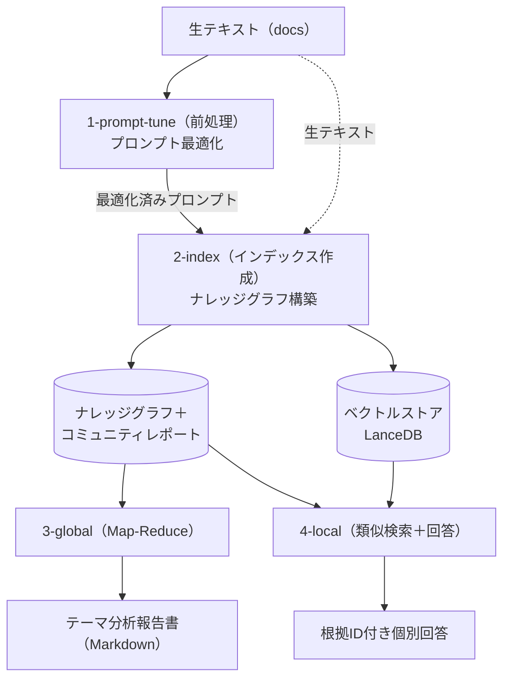

# GraphRAG ハッキングガイド（内部構造とログ解析）

このドキュメントでは、GraphRAG で LLM とのやり取りを記録するための改造手法から、蓄積されたログの分析、そして実際のソースコードとログを突き合わせたプロセス解析まで、GraphRAGの内部動作を深く理解するための開発者向け情報をまとめています。

> [!NOTE]
> **本ドキュメントは独自フォーク版の GraphRAG を対象にしています。** 本家のエンティティ・関係性抽出は
> 独自デリミタ（`<|>`／`##`）形式ですが、ローカルモデル（特に Gemma 4）ではデリミタを正しく再現できず
> レコードが silently drop される問題があったため、本フォークでは**抽出フェーズを構造化出力（JSON）に
> 変更**しています（あわせて prompt-tune が生成する抽出用 Few-Shot 例も JSON 形式になります）。
> 以降の解説・ログ例はこのフォークの挙動に基づきます。本家との差異が関わる箇所では、その都度注記します。

---

## 1. LLM ログ記録・分析機能の導入

LLM呼び出し（同期 `completion`・非同期 `completion_async`）をフックし、送受信データを自動でXMLファイルに保存する改造の概要と分析ツールについてです。

### 1.1 `lite_llm_completion.py` の改造概要
GraphRAG本体側のコード変更による影響を最小化するため、ログ出力の実処理（文字列整形やファイル書き込み）はすべて別ファイルの `rawlog_helper.py` にカプセル化しました。
これにより、`lite_llm_completion.py` の差分は以下の通り、インポートと return 文のラップだけの極小に抑えられています。

```python:packages/graphrag-llm/graphrag_llm/completion/lite_llm_completion.py
# lite_llm_completion.py への追加フック
from graphrag_llm.completion.rawlog_helper import (
    _wrap_response,
    _wrap_response_async,
)

# 同期呼び出しの return ラップ
return _wrap_response(response, messages, is_streaming)

# 非同期呼び出しの return ラップ
return await _wrap_response_async(response, messages, is_streaming)
```

### 1.2 `rawlogs` の仕様
XMLログはカレントディレクトリの `rawlogs/` 配下に保存されます。環境変数 `GRAPHRAG_RAWLOG_DIR` を指定すれば、`graphrag_quickstart/rawlogs/1-prompt-tune` のようにフェーズ別の出力先へ動的に切り替えられます。
GraphRAG は `asyncio`・マルチスレッドで大量のLLMリクエストを並行処理するため、`threading.Lock` による排他制御と、`glob` を避けたメモリ内カウンター（`O(1)`）で未使用の連番ファイル名（`00001.xml`、`00002.xml` …）を高速に確保します。
ログはLLMへのリクエスト履歴（`messages`）をそのままチャット形式で保存し、LLMからの返答も `role="assistant"` として同一階層にマージして記録します。
なお、フックの対象は `completion`／`completion_async`（チャット補完）のみです。embedding（`embedding_async`）は別経路を通るため rawlogs には残らず、後述の純アルゴリズム的な処理（チャンキング・グラフ構築・クラスタリングなど）も同様に記録されません。

```xml
<?xml version="1.0" encoding="utf-8"?>
<messages>
<message role="system"><![CDATA[
(システムプロンプト)
]]></message>
<message role="user"><![CDATA[
(クエリ内容)
]]></message>
<message role="assistant"><![CDATA[
(レスポンス内容)
]]></message>
</messages>
```

### 1.3 分析補助ツール
蓄積されたログを効率的に処理・分析するための Python スクリプトです。

* **`analyze_log.py` (LLMを使用)**: XMLファイルに保存された会話コンテキストを復元してローカルLLMに渡し、内容を要約・解説させるスクリプトです（JSONL形式で随時出力・レジューム対応）。
* **`analyze_fields.py` (LLM不要の高速処理)**: レスポンスがJSONであるかをパースし、JSONであればトップレベルのキー（フィールド）を抽出して、同一構造を持つファイルを自動的にグループ化します。連番のファイル一覧は `{00001..00223}.xml` のようにブレース展開表記でコンパクトにまとめて出力します。

いずれも `poe` タスク経由でディレクトリ単位で実行できます。

```bash
uv run poe analyze_log    graphrag_quickstart/rawlogs/1-prompt-tune
uv run poe analyze_fields graphrag_quickstart/rawlogs/2-index
```

### 1.4 長すぎるエラーメッセージの抑制
ローカルモデル（Ollama など）の検証中に接続タイムアウト等が起きると、エラーログ（スタックトレース）が長大になり原因特定が難しくなります。これは CLIフレームワーク `typer` が、例外発生時に局所変数を含む詳細な色付きトレース（Pretty Exceptions）をデフォルトで表示するためです。
エントリポイントの `packages/graphrag/graphrag/cli/main.py` で `app = typer.Typer(..., pretty_exceptions_enable=False)` を指定すると、Python標準の短いエラー表示に戻せます。

---

## 2. 実行プロセスとソースコード・ログの対応解析

GraphRAG の各実行プロセスにおいて、実際のソースコード（対象コミットID: `6d02c235`）のどこでプロンプトが組み立てられ、LLMがどのような形式でレスポンスを出力しているか（XMLログ解析結果）をセットで解説します。

### 2.0 GraphRAG 全体像（処理フローと生成データの概要）

個別のログを追う前に、まず GraphRAG 全体がどのような流れで処理を行い、各フェーズで何が入力・出力されるのかを俯瞰します。GraphRAG は大きく「**前処理（プロンプトチューニング）**」「**インデックス作成（ナレッジグラフ構築）**」「**クエリ（検索・質問応答）**」の3段階で構成され、これらが LLM を多数回呼び出しながら段階的にデータを変換・蓄積していきます。

> 以降のログ例は、題材テキストとして『クリスマス・キャロル』（Charles Dickens）を、解析・要約用のローカルLLMとして `gemma4:26b` を用いた実行結果に基づいています。

#### 処理フローの全体像

入力となる生テキスト（小説などのドキュメント）は、以下の流れでナレッジグラフ・コミュニティ要約・回答へと変換されます。



1. **`1-prompt-tune`（前処理）**: 生テキストの抜粋（`docs`）を入力に、テキストの性質に合わせてプロンプトを最適化します。ドメイン特定 → ペルソナ定義 → 評価基準 → エンティティ種別 → Few-Shot 例 → レポーター役割、の順に**最適化済みプロンプト群**を自動生成します。
2. **`2-index`（インデックス作成）**: 最適化済みプロンプトを用いてナレッジグラフを構築します。
   * テキストユニットからエンティティ／関係性を抽出（`gleaning` ループで抽出漏れを補完）
   * 異なるチャンクから得た同一エンティティの説明をマージ（名寄せ・矛盾解消）
   * グラフからコミュニティを検出
   * コミュニティごとに構造化レポート（JSON）を生成
3. **`3-global`（Global Search／マクロな問い）**: ドキュメント全体を跨ぐ問いに対し、Map-Reduce で回答します。Map でコミュニティレポートから要点を抽出し、Reduce で要点を集約して**テーマ分析報告書（Markdown）**を生成します。
4. **`4-local`（Local Search／ミクロな問い）**: 特定のエンティティに関する問いに対し、関連するエンティティ・関係性・生テキストを収集して**根拠ID付きの個別回答**を一発で生成します。

`3-global` と `4-local` は、いずれも `2-index` が生成したナレッジグラフ・コミュニティレポートを参照する独立したクエリ経路です。

#### フェーズごとの入出力と生成データ

| フェーズ | 主な入力 | LLM が行う処理 | 生成されるデータ |
| --- | --- | --- | --- |
| **1. prompt-tune** | 生テキストの抜粋（`docs`） | ドメイン・ペルソナ・評価基準・エンティティ種別・Few-Shot 例・レポーター役割の生成 | 後続フェーズで使う**最適化済みプロンプト群**（テキスト＋JSON） |
| **2. index** | テキストユニット、`entity_types` | エンティティ／関係性の抽出（gleaning ループ）、説明のマージ・要約、コミュニティレポート生成 | **ナレッジグラフ**（エンティティ・関係性）、統合済みエンティティ説明、**構造化コミュニティレポート（JSON）** |
| **3. global search** | コミュニティレポート、ユーザーの問い | Map で要点＋重要度スコアを抽出、Reduce で集約 | 要点リスト（JSON）→ **最終回答（Markdown のテーマ分析報告書）** |
| **4. local search** | クエリに類似するエンティティ・関係性・コベリエイト・生テキスト | コンテキストを組み立てて一発回答 | **根拠ID付きの個別回答テキスト** |

#### データ形式の特徴

GraphRAG が LLM から受け取るデータは、用途に応じて大きく3系統に分かれます。XMLログを解析する際は、どの系統かを意識すると構造が把握しやすくなります。

* **自然言語テキスト出力**: ドメイン特定、ペルソナ定義、エンティティ説明のマージ、Global Search の最終回答、Local Search の回答など。人間が読む説明文や、後続プロンプトに埋め込む文字列として利用されます。
* **構造化（JSON）出力**: **エンティティ・関係性の抽出（`extract_graph`、`GraphExtractionResult`）**、エンティティ種別（`EntityTypesResponse`）、コミュニティレポート（`CommunityReportResponse`）、Global Search の Map ステップの要点リストなど。Pydantic モデルを `response_format` に指定し、後続処理がプログラム的にパースできる厳密な形式で取得します。**かつて抽出フェーズは次項の独自デリミタ形式でしたが、構造化出力へ移行しました。**
* **独自デリミタ形式（レガシー／一部のみ）**: `<|>` や `##` でフィールドを区切る形式。**以前はエンティティ・関係性の抽出にも使われていましたが、現在は構造化出力に置き換えられています。** 現在この形式が残るのは、任意ステップのクレーム抽出（`extract_covariates`）や prompt-tune のレガシーテンプレートなど一部に限られます。ローカルモデルでは `<|>` を正しく再現できずレコードが silently drop される弱点があり、構造化出力への移行はこれを根絶する狙いがあります。

#### LLM 呼び出し以外の処理（rawlogs に映らない部分）

GraphRAG は LLM 呼び出しだけで成り立っているわけではなく、その**前後に純アルゴリズム的（決定論的）な処理**を多数挟みます。rawlogs に現れるのは LLM との対話だけなので、全体像をつかむには、ログに映らない以下の処理を意識する必要があります。

* **チャンキング**: 入力ドキュメントを tiktoken でトークン分割し、`n_tokens` 付きの `text_units`（抽出の入力単位）を生成します。
* **グラフ構築**: LLM が構造化出力で返した JSON（エンティティ／関係性のリスト）を**コード側でパース**し、表形式へ変換・マージします（旧来はデリミタ文字列 `<|>`／`##` をパースしていました）。
* **次数計算・重複統合**: 同名ノードを名寄せし、各ノードの次数（degree）を計算します。
* **コミュニティ検出**: 構築したグラフに対し、階層的 **Leiden** アルゴリズム（graspologic）でクラスタリングを行い「コミュニティ」を決定します。
* **embedding 生成**: `text_units`・`entities`・`community_reports` をベクトル化し、ベクトルストア（LanceDB）に格納します。**補完とは別の API（`embedding_async`）を使うため rawlogs には残りません。**
* **クエリ時のベクトル検索・コンテキスト整形**: クエリを embedding 化して類似検索を行い、得られた情報をトークン予算内に収まるよう貪欲に詰め込みます。

`graphrag index`（standard 法）のワークフローは以下の順に実行されます。LLM を使うのは抽出・コミュニティレポート生成など一部のステップのみで、残りはすべて非LLM処理です。

| 順 | workflow | 処理内容 | LLM |
| --- | --- | --- | --- |
| 1 | `create_base_text_units` | チャンキング（tiktoken でトークン分割） | – |
| 2 | `create_final_documents` | ドキュメントのメタデータ確定 | – |
| 3 | `extract_graph` | エンティティ／関係性の抽出（gleaning ループ） | ✓ |
| 4 | `finalize_graph` | 抽出結果のマージ・次数計算・重複統合 | – |
| 5 | `extract_covariates`（任意） | クレーム（共変量）の抽出 | ✓ |
| 6 | `create_communities` | 階層的 Leiden によるコミュニティ検出 | – |
| 7 | `create_final_text_units` | テキストユニットへ entity／relationship ID を付与 | – |
| 8 | `create_community_reports` | 構造化コミュニティレポート生成 | ✓ |
| 9 | `generate_text_embeddings` | embedding 生成 → ベクトルストア格納 | – |

以降のセクションでは、この全体像を踏まえ、各フェーズの具体的なログ（XML）とソースコードを突き合わせて詳細を解説します。

### 2.1 `1-prompt-tune` (自動プロンプトチューニング)
インデックス作成やクエリ処理用のシステムプロンプトを、テキストデータに合わせて動的に最適化するフェーズです。

#### 00001.xml（ドメイン特定）
引数のテキスト（`docs`）を連結し、`domain.py` 内の `GENERATE_DOMAIN_PROMPT` の `{input_text}` に埋め込んで LLM を呼び出します。
```python:packages/graphrag/graphrag/prompt_tune/generator/domain.py:generate_domain
domain_prompt = GENERATE_DOMAIN_PROMPT.format(input_text=docs_str)
response = await model.completion_async(messages=domain_prompt)
```
入力された小説の抜粋テキストから「文学作品」であると判断しています。
```text:結果
Literature
```

#### 00002.xml（専門家ペルソナの定義）
特定したドメインをタスクに構築し、`GENERATE_PERSONA_PROMPT` の `{sample_task}` に埋め込み、AIの「ペルソナ」を生成させます（`generate_persona` in `persona.py`）。
```text:結果
You are an expert Bibliometric Analyst and Network Scientist. You are skilled at mapping citation networks... in the Literature domain.
```

#### 00003.xml（評価基準の定義）
`domain`、`persona`、`input_text` を `GENERATE_REPORT_RATING_PROMPT` にフォーマットして送信します（`generate_community_report_rating` in `community_report_rating.py`）。
専門家の視点から、テキストデータの重要性を判断するための評価基準（0〜10のスコア）を生成しています。

#### 00004.xml（エンティティ種別の抽出） ※JSON出力
`ENTITY_TYPE_GENERATION_JSON_PROMPT` をユーザープロンプトとし、Pydantic モデルの `EntityTypesResponse` を `response_format` として指定します。
```python:packages/graphrag/graphrag/prompt_tune/generator/entity_types.py:generate_entity_types
response = await model.completion_async(messages=messages, response_format=EntityTypesResponse)
```
物語内の実体のカテゴリ（`entity_types`）を JSON 配列で出力します。
```json:結果
{"entity_types": ["person", "spirit", "location", "food", "object", "family_member", "time", "feeling"]}
```
ここで決まる `entity_types` は、後続の `2-index`（`extract_graph`）が**「何をノード化するか」を規定する起点**になります。この例では `food` / `object` / `feeling` / `time` といった題材固有の種別まで導出されているのが要点で、prompt-tune を実行せず既定の汎用種別（`organization` / `person` / `geo` / `event` など）のままインデックスすると、これらの種別に当てはまる細部は抽出の網に掛からず取りこぼされやすくなります。この「何が形式化され、何が落ちるか」の影響は「3. 考察」で詳述します。

#### 00005.xml 〜 00009.xml（エンティティ・関係性のFew-Shot抽出）
最大5つのバッチに分割し、`ENTITY_RELATIONSHIPS_GENERATION_PROMPT` を用いて `asyncio.gather` で並列に呼び出します。
```python:packages/graphrag/graphrag/prompt_tune/generator/entity_relationship.py:generate_entity_relationship_examples
history_groups = [history[i:i+batch_size] for i in range(0, len(history), batch_size)]
results = await asyncio.gather(*[...])
```
登場人物、アイテムなどの結びつきを抽出する Few-Shot のサンプル（日本語）が生成されます。**抽出フェーズの構造化出力への移行に合わせ、現在は Few-Shot 例も JSON 形式で生成されます**（旧来は `<|>`／`##` の独自デリミタ形式でした）。

#### 00010.xml（最終役割プロンプトの生成）
`domain`、`persona`、`docs` を `GENERATE_COMMUNITY_REPORTER_ROLE_PROMPT` に埋め込み、コミュニティ要約レポートを担当する「コミュニティ・リポーター」の役割を定義させます（`generate_community_reporter_role` in `community_reporter_role.py`）。
```text:結果
You are a Literary Structural Analyst, with expertise in analyzing the themes...
```


### 2.2 `2-index` (インデックス作成 / ナレッジグラフ構築)
テキストからエンティティと関係性を抽出し、重複を統合した後にグラフ構造を検出してコミュニティ要約レポートを作成します。全体で246個のログが記録され、おおよそ以下の区間でステップが進みます。
なお、抽出に先立って入力ドキュメントは**チャンキング**され、`n_tokens` 付きの `text_units` が各抽出呼び出しの入力になります（このチャンキング自体は非LLM処理のため rawlogs には現れません）。

#### 00001.xml（疎通確認）
LLM API が正常に稼働しているかを確かめるテスト接続です（`Hello World` を返すのみ）。

#### 00002.xml 〜 00081.xml（エンティティ・関係性の抽出 / 全80ファイル）
テキストユニットと `entity_types` を送信します。1回目の抽出後、`_max_gleanings` 回を上限に `CONTINUE_PROMPT` で抽出漏れを補い、さらに `LOOP_PROMPT` で「まだエンティティが残っているか」を判定し、「Y」以外の返答で打ち切るループを回します。
```python:packages/graphrag/graphrag/index/operations/extract_graph/graph_extractor.py:GraphExtractor._process_document
for i in range(self._max_gleanings):
    messages_builder.add_user_message(CONTINUE_PROMPT)
    ...
```
小説本文から、登場人物、場所、出来事の結びつきを検出し抽出します。
抽出後、LLM が構造化出力で返した JSON（エンティティ／関係性のリスト）は**コード側でパース**され、表形式へ変換・マージされ、各ノードの次数（degree）が計算されます（`finalize_graph` の非LLM処理）。なお抽出フェーズは旧来の独自デリミタ形式から構造化出力へ移行しており、古いコミットの rawlog では `<|>`／`##` 形式の出力が記録されています。

#### 00082.xml 〜 00223.xml（エンティティの要約・マージと矛盾解消 / 全142ファイル）
異なるチャンクから抽出された同一エンティティの説明リストを取得し、トークン上限を計算しながら LLM に統合させます（`_summarize_descriptions_with_llm` in `description_summary_extractor.py`）。
断片的な記述を名寄せし、1つの整理された紹介文へと統合します。

#### 00224.xml（構造化コミュニティレポートの生成） ※JSON出力
このレポート生成の**前段**で、グラフに対し階層的 **Leiden** アルゴリズムによるコミュニティ検出（`create_communities`、非LLM）が走り、レポート対象となる「コミュニティ」が決定されています。
ここでは「コミュニティ」内のエンティティ情報をプロンプトに埋め込み、Pydantic モデル `CommunityReportResponse` を指定して厳密な JSON で出力させます（`CommunityReportsExtractor.__call__` in `community_reports_extractor.py`）。
```json:結果
{
    "title": "エベネザー・スクルージの精神的変容と超自然的ネットワーク",
    "summary": "本コミュニティは、主人公エベネザー・スクルージを中心とした...",
    "findings": [ ... ],
    "rating": 9.5
}
```

最後に、ここまでで得られた `text_units`・`entities`・`community_reports` を **embedding 化してベクトルストア（LanceDB）に格納する** `generate_text_embeddings` が走ります。この処理はクエリ時の類似検索の土台になりますが、補完とは別 API を使うため rawlogs には現れません。


### 2.3 `3-global` (Global Searchによる全体質問)
ドキュメント全体を跨ぐマクロな問いに対する質問応答プロセスです（Map-Reduce）。以降のログは、次のクエリを投げた際のものです。
```bash
uv run graphrag query --method global "この物語の主要なテーマは何ですか？"
```

#### 00001.xml & 00002.xml（要点抽出 Mapステップ） ※JSON出力
Map に渡すコミュニティレポートのサブセットは、ランク（`rank`）とトークン予算に基づいて選定・バッチ化されます（既定では非LLM処理）。これを `map_system_prompt` に埋め込み、返却された JSON から要点と重要度スコアを抽出します（`_map_response_single_batch` in `global_search/search.py`）。
```json:結果
{
    "points": [
        {"description": "主人公エベネザー・スクルージの精神的変容...", "score": 100}
    ]
}
```

#### 00003.xml（回答集約 Reduceステップ）
得られた要点リストを重要度スコアの降順にソートし、トークン予算内に収まるよう結合する処理（非LLM）を経て、`reduce_system_prompt` に埋め込んで最終回答を生成させます（`_reduce_response` in `global_search/search.py`）。
重複排除と論理整合性の調整が行われ、最終的な Markdown 形式のテーマ分析報告書が出力されます。


### 2.4 `4-local` (Local Searchによる個別質問)
特定のエンティティや直接関係する情報を抽出して答えるミクロな問いへの応答です。以降のログは、次のクエリを投げた際のものです。
```bash
uv run graphrag query --method local "スクルージはどのような人物で、誰とどのような関係がありますか？"
```

#### 00001.xml（ローカルコンテキストからの直接回答）
この回答生成の**前段**で、`LocalContextBuilder` はまずクエリを embedding 化し、エンティティ説明のベクトルに対して**類似検索**を行って関連エンティティを選び出します（`map_query_to_entities` in `entity_extraction.py`、非LLM）。続いて関連リレーション・コベリエイト・生テキストを、コンテキストウィンドウのトークン予算内に収まるよう貪欲に詰め込みます。
なお、ここで詰め込まれる**コベリエイト（共変量＝クレーム）は `extract_covariates`（2.0 のワークフロー表の任意ステップ）が有効な場合にのみ存在**し、無効化されているとこの層は空になります。その場合 Local の根拠は実質的に「エンティティ・関係性の要約＋生テキスト」に限られます。
こうして組み立てたコンテキストをシステムプロンプトに埋め込み、一発で回答を生成させます（`LocalSearch.search` in `local_search/search.py`）。スクルージの性格や周辺人物との関係性が整理され、根拠ID付きの丁寧な解説テキストとして出力されます。


### 2.5 まとめ
XMLログのパースとソースコードを対応させることで、GraphRAGの高度な動作ロジック（チャンキング、抽出・マージ、コミュニティ要約、Map-Reduceやローカル検索のコンテキスト構築）がどのように実装されているかが明確に理解できます。
ただし rawlogs が捉えるのは LLM との対話のみであり、チャンキング・グラフ構築・Leiden によるコミュニティ検出・embedding 生成やベクトル検索といった非LLM処理は別途存在します。これらを併せて意識することで、はじめて GraphRAG の全体像が見えてきます。
ログを監視・分析することは、LLMを使ったナレッジグラフ構築の品質をデバッグし、プロンプトを洗練させる上で非常に強力な手段となります。
そして、こうして可視化した処理フロー（生テキスト → 抽出 → マージ → 要約）を俯瞰すると、各段階で情報がどのように構造化され、同時に何が削ぎ落とされるのかが見えてきます。次章では、この観点から GraphRAG の設計思想と限界を考察します。

---

## 3. 考察：GraphRAG は文章を完全にはグラフ化しない

ここまでの内部構造を踏まえると、GraphRAG の設計思想と限界が見えてきます。理想を言えば、文章中の
あらゆる命題（「誰が・いつ・何を・どうしたか」、個々の数量・固有名・台詞・条件といった細部まで）が
漏れなく形式表現（ノード／エッジ／属性）へ変換され、グラフを辿るだけで任意の事実に到達できる状態です。
しかし `2-index` の処理を追えば分かるとおり、**GraphRAG はそうした完全な形式化を行っておらず、
意図的に「疎なグラフ＋生テキスト」の折衷**を採っています。

### 3.1 忠実度と構造化のトレードオフ（3 層構造）

`2-index` が生成する成果物は、抽象度の異なる 3 層から成り、**上に行くほど集約・横断に強くなる代わりに
忠実度が落ちる**という関係にあります。

| 層 | 構造化 | 忠実度 | クエリ時の到達手段 |
| --- | --- | --- | --- |
| `text_units`（チャンク） | 低（非構造の生文） | 高（原文ほぼそのまま） | embedding 類似検索のみ |
| `entities` / `relationships`（グラフ） | 中（三つ組に近い） | 中（抽出は選択的・説明は要約） | グラフ辿り＋エンティティ検索 |
| `community_reports`（要約） | 高（テーマ単位） | 低（大幅に圧縮） | Map-Reduce |

`4-local` は主に下 2 層（特に生テキスト）に、`3-global` は最上層の要約に依存します。**どちらも「全命題を
形式化した完全なグラフ」を引いているわけではありません**。Local が細部に比較的強く、Global が細部に
弱いのは、依存する層の忠実度の差に対応します。

### 3.2 なぜ完全な形式化に至らないか

- **抽出はサリエンス（顕著性）バイアスを持つ**。`extract_graph` のエンティティ／関係性抽出は LLM 任せで、
  対象は `entity_types` に列挙された種別に絞られます。型に当てはまらない細部の事実（数量・固有の台詞・
  一回限りの所作など）は**ノードもエッジも持てず**、`text_units` の生テキストの中にしか残りません。

> [!NOTE]
> **サリエンス（salience）とは「顕著性」**、すなわちそのテキストの中でどれだけ目立つ・際立っているかの
> 度合いを指す語です。抽出は LLM 任せのため、**LLM が「重要そう・目立つ」と判断した要素を優先的に拾い、
> 目立たない細部は落とす**傾向があります。繰り返し登場する主要人物・物語の中心となる場所・筋を動かす
> 出来事（高サリエンス）は拾われやすく、一回限りの所作や具体的な数量、ある場面だけの台詞（低サリエンス）は
> 落ちやすい、という偏りです。なおこの「設計上の脱落」は、後述の書式由来の脱落（デリミタ崩れ）とは別物で、
> 構造化出力へ移行しても残ります。

- **関係は粗く、属性・数量・条件・因果が落ちる**。「A が B を助ける」は残っても、「いつ・どの手段で・
  何回・なぜ」といった限定はエッジに載りにくく、`finalize_graph` のマージやエンティティ説明の要約、
  さらにコミュニティレポート生成での圧縮を経るほど、上位層へ昇格しなかった細部は失われます。
- **クレーム（共変量）の層は既定で空になりやすい**。`extract_covariates` はエンティティに紐づく事実文を
  拾う任意ステップですが（2.0 のワークフロー表を参照）、無効化されていると命題レベルの事実を保持する
  受け皿がそもそも存在しません。
- **全命題の形式化は本質的に高コスト**。文単位で論理形式（意味解析・AMR・RDF 三つ組など）へ落とすことは
  オープンドメインではスキーマ問題と計算量の両面で割に合わず、GraphRAG は**疎なグラフ＋原文保持**という
  実用的な近似を選んでいます。

> [!NOTE]
> **「設計上の脱落」と「書式由来の脱落」は別物です。** 上に挙げたサリエンス／抽象化による脱落は
> 設計上のもので、構造化出力に移行しても残ります。一方、抽出フェーズが独自デリミタ（`<|>`／`##`）
> だった頃は、これとは別に、ローカルモデルがデリミタを正しく再現できずレコードが silently drop される
> **書式由来の脱落**がありました（特に関係性で起きやすい）。抽出を構造化出力（`response_format`）へ
> 移行したことで後者は原理的に解消され、抽出層の忠実度はその分上がりますが、本節で述べる設計上の
> トレードオフ（疎なグラフ＋生テキスト）自体は変わりません。

### 3.3 含意

つまり GraphRAG のグラフは**「文章の完全な意味表現」ではなく、顕著なエンティティ間を辿るための
ナビゲーション索引**です。設計としてはコーパス横断のセンスメイキング（テーマ抽出・関係の俯瞰）に
最適化されており、これは Global Search が「全体のテーマは何か」型の問いに強いことと表裏一体です。
一方で、ピンポイントな事実 QA は守備範囲の外に近く、

- **Global** は要約層しか見ないため、要約段階で圧縮・脱落した細部には**原理的に到達できません**。
- **Local** は最終的に生チャンクへの embedding 検索（実質ふつうの RAG）にフォールバックするため、
  その**リコール限界をそのまま引き継ぎます**。問われた一節を含むチャンクが類似検索で上位に来なければ、
  コンテキストに載らず答えられません。

これらは不具合ではなく、3 層構造が引き受けている**設計上のトレードオフの現れ**です。

### 3.4 形式化の網を細かくする方向

「全文をグラフ化する」理想に近づけたい場合の手当てとしては、次のような選択肢があります。いずれも
忠実度と索引コストのトレードオフ上の判断であり、網を細かくするほど索引は重くなります。

- **クレーム抽出（`extract_covariates`）の有効化**：エンティティに紐づく事実文を保持する層を足す。
- **`entity_types` の見直し（プロンプトチューニングの活用）**：`1-prompt-tune`（2.1）はテキストを読んで
  題材に適した `entity_types` を自動生成する仕組みである。これを実行する、あるいは生成結果を確認・補強することで、
  既定の汎用種別では取りこぼしていた対象をノード化できる。逆に prompt-tune を省いて汎用種別のまま索引すると、
  この層の網羅性は上がらない。
- **より小さなチャンク＋命題単位の索引化**：生テキスト層の検索粒度を上げ、Local のリコールを改善する。
- **グラフとベクトルのハイブリッド検索**：構造（グラフ辿り）と忠実度（生テキスト）の双方を併用する。
